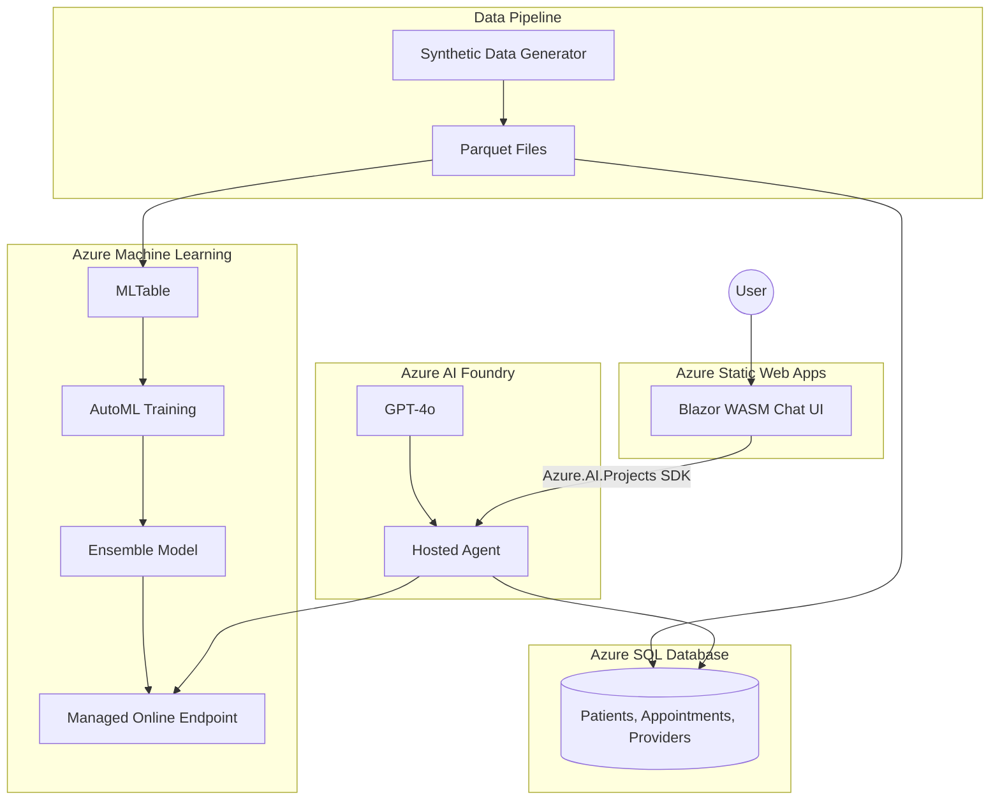

# Medical Appointment No-Show Predictor

An AI-powered solution that uses machine learning and conversational AI to predict medical appointment no-shows and provide actionable scheduling recommendations.

## Overview

This demonstration shows how an ML model combined with a Gen AI chat agent can:
- Identify patients at risk of missing appointments
- Provide prioritized recommendations for clinical staff
- Surface weekly no-show forecasts for capacity planning

## User Stories

| Story | Description |
|-------|-------------|
| **High-Risk Appointments** | Ask "Which patients are at risk of missing tomorrow's appointments?" to get a ranked list with probabilities |
| **Scheduling Recommendations** | Get actionable guidance like confirmation calls and overbooking suggestions |
| **Weekly Forecast** | View daily no-show predictions for capacity planning |

## Architecture



### Component Flow

1. **Data Generation**: Python scripts generate synthetic patient and appointment data
2. **Model Training**: Azure AutoML trains a binary classifier on historical no-show patterns
3. **Database Seeding**: Parquet files are loaded into Azure SQL for runtime queries
4. **Agent Hosting**: Azure AI Foundry hosts the .NET agent with GPT-4o for natural language understanding
5. **Inference**: Agent tools query SQL for appointments and ML endpoint for predictions
6. **Frontend**: Blazor WASM provides a chat interface using the AG-UI streaming protocol

## Project Structure

```
├── agent/               # .NET 10 AI Agent
│   └── src/NoShowPredictor.Agent/
│       ├── Tools/       # Agent tools (appointments, predictions, recommendations)
│       ├── Services/    # ML endpoint client, recommendation engine
│       ├── Data/        # SQL data access layer
│       └── Models/      # Domain entities
│
├── frontend/            # Blazor WebAssembly UI
│   └── src/NoShowPredictor.Web/
│       ├── Pages/       # Chat interface
│       ├── Components/  # Message display, theme toggle
│       └── Services/    # Agent API client
│
├── ml/                  # Machine Learning
│   ├── src/
│   │   ├── data/        # Synthetic data generation
│   │   ├── training/    # AutoML configuration
│   │   └── evaluation/  # Model validation
│   └── deployment/      # Azure ML endpoint specs
│
├── infra/               # Terraform infrastructure
│   └── modules/         # Foundry, ML, SQL, ACR, SWA
│
└── specs/               # Design specifications
    └── 001-no-show-predictor/
        ├── spec.md      # Feature requirements
        ├── plan.md      # Technical architecture
        ├── data-model.md # Entity schemas
        └── quickstart.md # Deployment guide
```

## Technology Stack

| Component | Technology |
|-----------|------------|
| Agent Framework | Azure.AI.AgentServer.AgentFramework (.NET 10) |
| Agent Hosting | Azure AI Foundry Hosted Agents |
| ML Training | Azure AutoML |
| ML Inference | Azure ML Managed Online Endpoints |
| Frontend | Blazor WebAssembly + MudBlazor |
| Frontend Hosting | Azure Static Web Apps |
| Database | Azure SQL Database |
| Infrastructure | Terraform (AzApi Provider) |
| Deployment | Azure Developer CLI (azd) |
| Authentication | Managed Identity / DefaultAzureCredential |

## Hosted Agent Integration

This section documents key integration patterns for Azure AI Foundry Hosted Agents.

### SPA App Registration

The frontend SPA requires an Entra ID app registration with the **Azure AI** API permission:

1. **Create App Registration** with SPA platform (redirect URI to your static web app)
2. **Add API Permission**: Azure AI → `user_impersonation` (Delegated)
3. **Grant Admin Consent** (or configure user consent)

The Azure AI service principal ID is `18a66f5f-dbdf-4c17-9dd7-1634712a9cbe` (constant across all Azure tenants).

Without this permission, the SPA cannot obtain tokens with scope `https://ai.azure.com/.default` to authenticate to hosted agents.

### Frontend → Agent Communication

The frontend uses the **Azure.AI.Projects SDK** (not raw HTTP calls) to communicate with the hosted agent:

```csharp
// Token scope for AI Foundry
var credential = new MsalTokenCredential(tokenProvider, ["https://ai.azure.com/.default"]);

// SDK-based agent invocation
var projectClient = new AIProjectClient(new Uri(projectEndpoint), credential);
var agent = await projectClient.Agents.GetAgentAsync("noshow-predictor");
var responseClient = projectClient.OpenAI.GetProjectResponsesClientForAgent(agent);
var response = await responseClient.CreateResponseAsync(userMessage);
```

### Hosted Agent API Endpoints

Hosted agents automatically expose these endpoints:

| Endpoint | Purpose |
|----------|---------|
| `GET /agents/{name}` | Get agent metadata (use for health checks) |
| `POST /responses` | Simple request/response pattern |
| `POST /threads` | Create conversation thread |
| `POST /threads/{id}/runs` | Execute agent on thread |

### Identity & RBAC

Hosted agents run with the **Foundry Project's system-assigned managed identity**.

**SQL Identity Format**: `{foundry-account}/projects/{project-name}`

Example: `aif-noshow-dev-ncus-001/projects/proj-noshow-dev-ncus-001`

| Resource | Role | Purpose |
|----------|------|---------|
| AI Foundry Account | Cognitive Services User | Access models/deployments |
| ML Workspace | Azure ML Data Scientist | Invoke ML endpoints |
| SQL Server | SQL DB Contributor + db_datareader | Query database |
| ACR | AcrPull | Pull agent container image |
| Key Vault | Key Vault Secrets User | Access secrets (optional) |
| Storage | Storage Blob Data Contributor | ML artifacts access |

### ML Endpoint Authentication

The agent authenticates to Azure ML using `DefaultAzureCredential` with scope `https://ml.azure.com/.default`:

```csharp
var tokenRequest = new TokenRequestContext(["https://ml.azure.com/.default"]);
var token = await credential.GetTokenAsync(tokenRequest);
```

### MLflow No-Code Deployment

AutoML-trained models require the full conda.yaml from training. Use MLflow No-Code Deployment instead of custom scoring scripts—Azure ML automatically builds the environment from the model's embedded dependencies.

```yaml
# deployment.yaml - no environment or code_configuration needed
name: noshow-model-v5
endpoint_name: noshow-predictor
model: azureml:noshow-predictor:1
instance_type: Standard_DS2_v2
instance_count: 1
```

### azd Commands for Hosted Agents

| Command | Purpose |
|---------|---------|
| `azd ai agent init` | Initialize a **new** agent project (scaffolding only) |
| `azd deploy {service}` | Deploy or redeploy an existing agent (e.g., `azd deploy noshow-predictor`) |
| `azd up` | Deploy all services including agent |

**Key insight**: `azd ai agent init` is for creating new projects, not for deploying. Use `azd deploy {service-name}` to redeploy after code changes.

## Prerequisites

- Azure subscription
- Azure CLI 2.60+
- Azure Developer CLI (azd) 1.9+
- .NET 10 SDK
- Python 3.11
- Terraform 1.5+
- Docker

## Azure RBAC for Browser Auth

When the frontend calls the Foundry **project agent endpoint** from the browser,
the signed-in user must have the **Azure AI User** role on the Foundry project.

Use this script to grant the role:

```powershell
# Uses AZURE_AI_PROJECT_ID from azd env
./infra/scripts/grant-azure-ai-user.ps1 -UserPrincipalName "you@yourtenant.com"

# Or specify the scope explicitly
./infra/scripts/grant-azure-ai-user.ps1 -UserPrincipalName "you@yourtenant.com" \
    -Scope "/subscriptions/<subId>/resourceGroups/<rg>/providers/Microsoft.CognitiveServices/accounts/<account>/projects/<project>"
```

## Quick Start

See the detailed deployment guide at [specs/001-no-show-predictor/quickstart.md](specs/001-no-show-predictor/quickstart.md).

**Summary:**

```powershell
# 1. Clone and configure
git clone <repo-url>
cd no-show-demo

# 2. Deploy infrastructure (azd handles Terraform)
azd auth login
azd up

# 3. Train ML model (one-time setup)
cd ml
python -m venv .venv && .\.venv\Scripts\Activate.ps1
pip install -r requirements.txt
python src/data/generate_synthetic.py   # Generate synthetic data
python src/training/train_automl.py     # Train model in Azure ML
cd ..

# 4. Seed database and redeploy
./infra/scripts/seed-database.ps1       # Load data into SQL
azd deploy noshow-predictor             # Redeploy agent if needed
```

## Sample Queries

| Query | Response |
|-------|----------|
| "Which patients are most likely to miss their appointments tomorrow?" | Ranked list with patient name, time, provider, risk score |
| "What scheduling actions should I take for tomorrow?" | Prioritized recommendations (confirmation calls, overbooking) |
| "What does the no-show forecast look like for this week?" | Daily breakdown with expected no-show rates |

## Agent Tools

The agent includes 17 tools across 5 tool classes:

| Category | Tools |
|----------|-------|
| **Appointments** | GetAppointmentsByDateRange, GetAppointmentsByProvider, GetAppointmentsByPatient, SearchPatients, GetPatientNoShowStats, GetWeeklyForecast |
| **Predictions** | GetPredictions, GetHighRiskAppointments |
| **Recommendations** | GetRecommendations, GetRecommendationSummary, GetPatientRecommendation |
| **No-Show Risk** | GetNoShowRisk, GetSchedulingActions, GetPatientRiskProfile |
| **Patient** | GetPatientHistory, GetPatientRiskExplanation, CompareToClinicAverages |

## Features

- **ML-Powered Predictions**: AutoML-trained model with feature importance explanations
- **Graceful Degradation**: Fallback predictions when ML endpoint unavailable
- **Data Quality Warnings**: Alerts for missing demographics or long lead times
- **Anomaly Detection**: Weekly forecast highlights unusual volume days
- **Dark/Light Mode**: Accessible UI with theme toggle
- **Comprehensive Tests**: Unit test coverage for tools and services

## Local Development

### Agent

```powershell
cd agent/src/NoShowPredictor.Agent
dotnet run

# API available at http://localhost:8088
```

### Frontend

```powershell
cd frontend/src/NoShowPredictor.Web
dotnet run

# UI available at https://localhost:5001
```

### Run Tests

```powershell
cd agent
dotnet test
```

## Environment Variables

| Variable | Description |
|----------|-------------|
| `AZURE_AI_PROJECT_ENDPOINT` | AI Foundry project endpoint (`https://{account}.cognitiveservices.azure.com/api/projects/{project}`) |
| `AZURE_OPENAI_ENDPOINT` | Azure OpenAI endpoint for the Foundry account |
| `AZURE_OPENAI_DEPLOYMENT_NAME` | GPT model deployment name (default: `gpt-4o`) |
| `SQL_CONNECTION_STRING` | Azure SQL connection string with AAD auth |
| `ML_ENDPOINT_URI` | ML inference endpoint URL (includes `/score`) |
| `APPLICATIONINSIGHTS_CONNECTION_STRING` | App Insights for agent telemetry |

**Note**: The project endpoint should **not** include `/agents/{name}` - `azd deploy` appends that automatically.

## Documentation

- [Specification](specs/001-no-show-predictor/spec.md) - User stories and requirements
- [Technical Plan](specs/001-no-show-predictor/plan.md) - Architecture and implementation details
- [Data Model](specs/001-no-show-predictor/data-model.md) - Entity schemas and relationships
- [Quickstart](specs/001-no-show-predictor/quickstart.md) - Deployment guide
- [Agent README](agent/README.md) - Agent component details
- [Frontend README](frontend/README.md) - Frontend component details
- [ML README](ml/README.md) - ML pipeline documentation

## License

This project is for demonstration purposes only. Synthetic data is used throughout—no real patient information.
